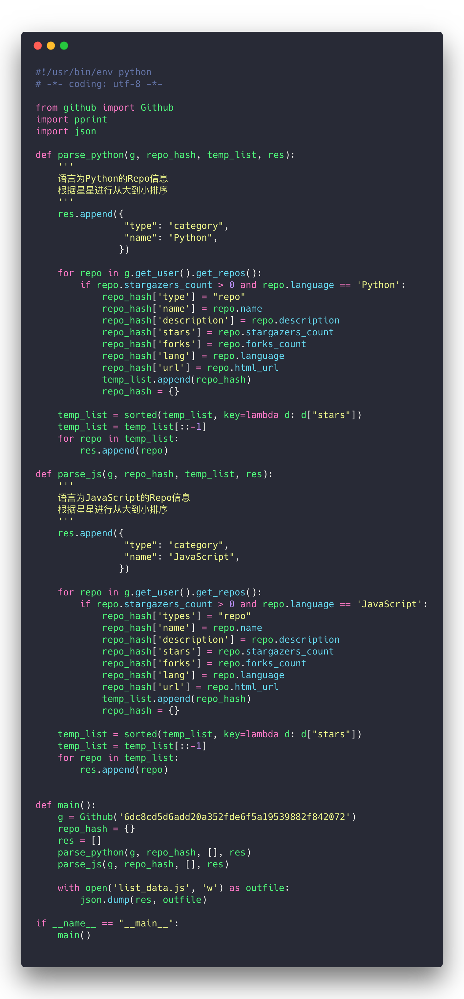
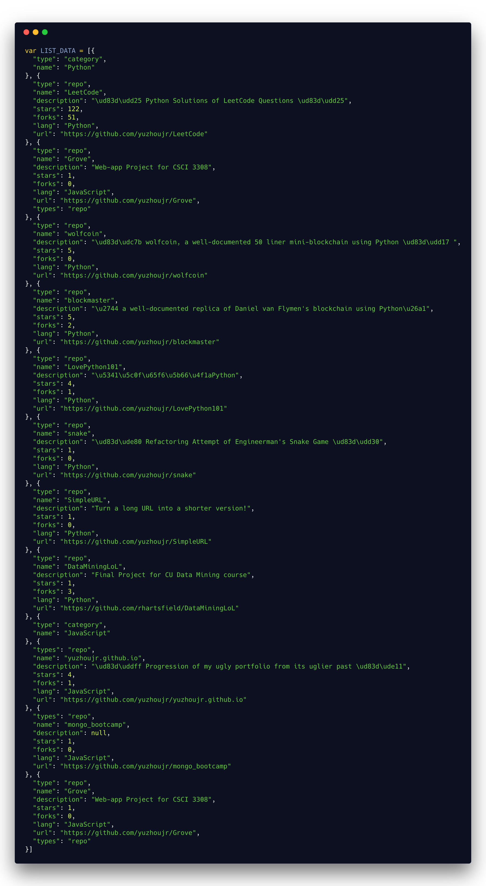

<h3 style="text-align:center;font-weight: 300;" align="center">
  
</h3>

<p align="center">
  
  
  
</p>


> In order to showcase my github project on my portfolio, this script is intended to grab necessary data and export them as a JSON file using the Github REST API.

## External Libraries

Third Party libraries are used in this project

| Package           |   Description |
| ------------- |:-------------:|
| `pygithub`     |  Github RESTful API Python's Framwork  |
| `json`     |  JSON dump  |
| `pprint`     |  prettyprint JSON  |

## Getting Started

The user needs to have Terminal/Bash installed, Python version in this project is 3.0+.

### Run

🐍 Python3

```bash
$ python3 parser.py
```

## Code



## Demo Output


## To-Do

🍉 The `js` output doesn't include var naming, see how to insert that naming prior inserting the JSON

🍉 Code Clean up, and copy the python script into github.io folder

🍉 License check

## License

🌱 MIT 🌱

---

>  [yuzhoujr.com](http://www.yuzhoujr.com) &nbsp;&middot;&nbsp;
>   [@yuzhoujr](https://github.com/yuzhoujr) &nbsp;&middot;&nbsp;
>   [@yuzhoujr](https://linkedin.com/in/yuzhoujr)
